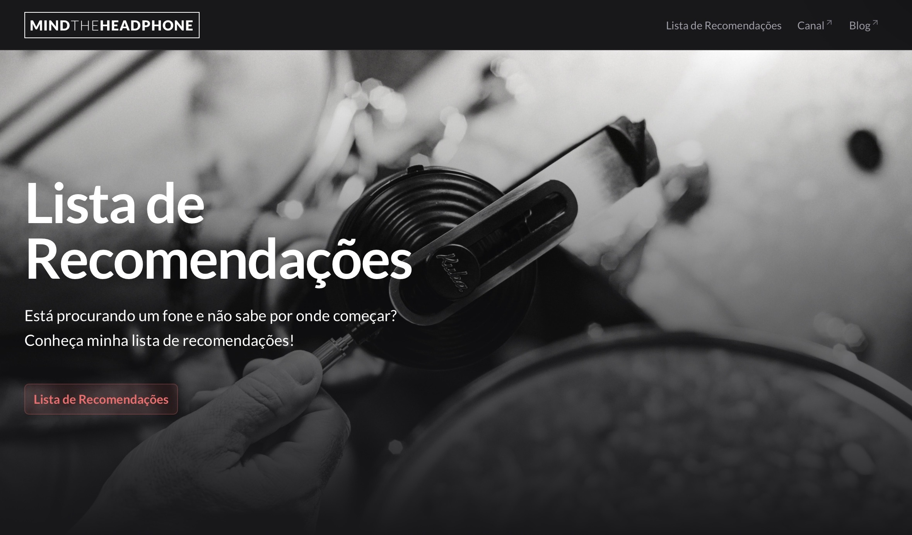

# 🎧 Mind the Headphone

<div style="display: inline">
  
  
  
  
</div>


> Headphone recommendation platform made for free for the **Mind the Headphone** YouTube channel



## 🔍 About

This website was created as a **free contribution** to the [Mind the Headphone YouTube channel](https://youtube.com/@mindtheheadphone) to serve as a home for the channel and help viewers find the perfect headphones through the channel's list of recommendations.

## 🎯 Features

- **Filtering**: Filter headphones by price range, sound signature, and category;
- **Reviews**: Direct links to the channel's reviews;
- **Responsive Design**: Works perfectly on all devices.

## 🛠️ Tech Stack

- **[Bun](https://bun.com/)** - JavaScript runtime and package manager
- **[Nuxt.js](https://nuxt.com/)** - Fullstack Vue.js framework with SSR
- **[Nuxt UI](https://ui.nuxt.com/)** - Beautiful and customizable UI components
- **[TypeScript](https://www.typescriptlang.org/)** - Type-safe development
- **[Vercel](https://vercel.com/)** - Fast and easy deployment

## 🚀 Getting Started

```bash
# Install dependencies
bun install

# Start development server
bun run dev

# Build for production
bun run build
```

## 🔗 Links

- **YouTube Channel**: [@mindtheheadphone](https://youtube.com/@mindtheheadphone)
- **Original Blog**: [mindtheheadphone.com.br](https://old.mindtheheadphone.com.br)
- **Kuba Audio**: [kuba.audio](https://kuba.audio) - Brazilian headphone brand